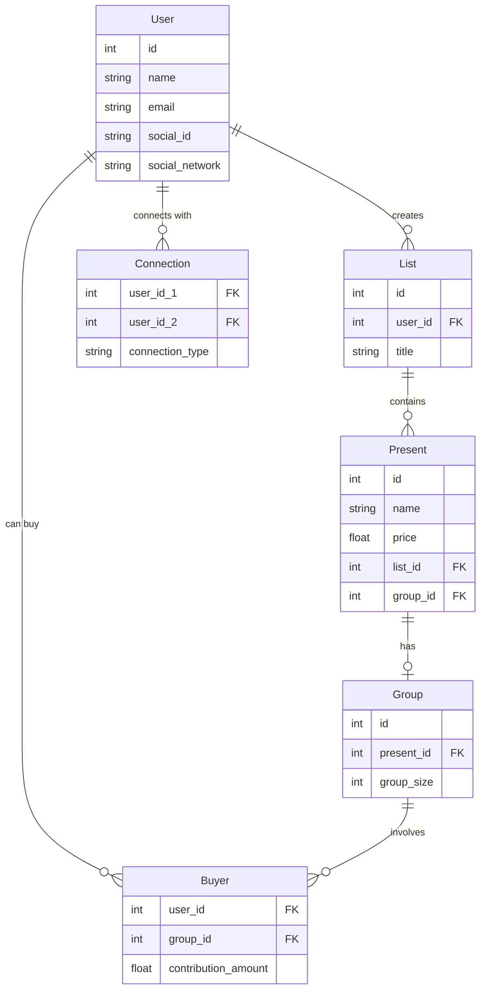

# Technical Specification for Gifterz

## Overview
This application is a platform that allows users to create gift wishlists, share these lists with friends, and purchase or contribute to group gifts. The core functionality includes list management, organizing group purchases for expensive gifts, and connecting with friends via social networks or direct contacts.

---

## Core Functionalities

### 1. User Management
- **Registration and Login** via:
  - Email.
  - External social networks (Facebook, Instagram).
- **Connecting with friends** via:
  - Synchronization with social networks.
  - In-app search functionality.

### 2. Wishlists
- Users can create and manage their own wishlists.
- Each wishlist contains gifts with the following information:
  - Name.
  - Price.
  - Reservation status.

### 3. Gifts
- Users can add gifts to their wishlists.
- Gifts can be marked as "group gifts" to enable group purchasing for expensive items.

### 4. Group Purchases
- Groups for shared purchasing are automatically created when a gift is marked as "group gift."
- Participants can contribute specific amounts.
- Groups have a maximum size limit defined by `group_max_size`.

### 5. Connections Between Users
- Users can connect with one another.
- Connections are classified based on `connection_type` (e.g., friends, blocked).

---

## User Interface

### Landing Page
- The user accesses the web application and sees:
  - Login field for username and password.
  - Button to log in via social networks.
  - Registration button.

### User Profile
- After logging in, the user sees their profile:
  - Displaying their username.
  - Showing their wishlist (if none exists, a button to create one is available).
- **Features:**
  - A search bar at the top for finding other users.
  - A friend list on the right-hand side.
  - Clicking on a friend’s name navigates to their profile and displays their wishlist.

### Wishlist Management
- Users can create a wishlist with fields for the wishlist name and gift details.
- When adding a gift, users can input the following details:
  - Gift name.
  - Gift link.
  - Gift price.
- Once saved, the wishlist becomes accessible to others.

### Viewing Others' Wishlists
- When viewing another user's wishlist:
  - A button is available next to each gift for "Create Group" or "Join Group," depending on whether a group already exists.
  - When creating a group, users set the number of participants, and the price is evenly distributed among them.
  - The recipient of the wishlist cannot see who has reserved a particular gift.

---

### Mermaid Diagram:

---

## Database Schema

### User Table
| Column            | Type   | Description                         |
|-------------------|--------|-------------------------------------|
| id                | int    | Primary key.                       |
| name              | string | User's name.                       |
| email             | string | User's email address.              |
| social_id         | string | ID from external social network.   |
| social_network    | string | Name of the social network.        |

### Present Table
| Column            | Type   | Description                         |
|-------------------|--------|-------------------------------------|
| id                | int    | Primary key.                       |
| name              | string | Name of the gift.                  |
| price             | float  | Price of the gift.                 |
| list_id           | int    | Foreign key to List table.         |
| group_id          | int    | Foreign key to Group table.        |

### List Table
| Column            | Type   | Description                         |
|-------------------|--------|-------------------------------------|
| id                | int    | Primary key.                       |
| user_id           | int    | Foreign key to User table.         |
| title             | string | Title of the wishlist.             |

### Group Table
| Column            | Type   | Description                         |
|-------------------|--------|-------------------------------------|
| id                | int    | Primary key.                       |
| present_id        | int    | Foreign key to Present table.      |
| group_size        | int    | Maximum number of participants.    |

### Buyer Table
| Column            | Type   | Description                         |
|-------------------|--------|-------------------------------------|
| user_id           | int    | Foreign key to User table.         |
| group_id          | int    | Foreign key to Group table.        |
| contribution_amount | float| Amount contributed by the user.    |

### Connection Table
| Column            | Type   | Description                         |
|-------------------|--------|-------------------------------------|
| user_id_1         | int    | First user ID.                     |
| user_id_2         | int    | Second user ID.                    |
| connection_type   | string | Type of connection (e.g., friends).|
